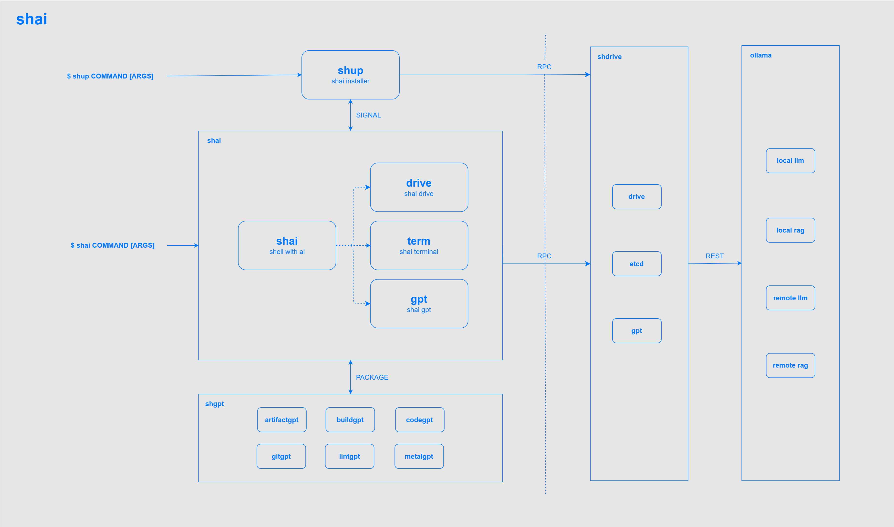

```
$ hi, what's shai?

shai, shell with ai superpowers.🚀

$ great! show shai features please.

1. artifactgpt
   artifact component with gpt

2. buildgpt
   compiling and building with gpt

3. codegpt
   source code with gpt

4. gitgpt
   git repository with gpt

5. lintgpt
   bugs and vulnerabilities with gpt

6. metalgpt
   bare metal server with gpt

$ awesome!🤩
```


